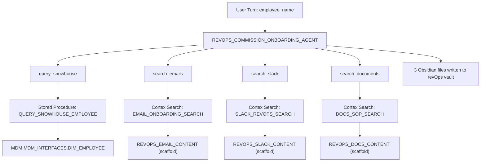

# Deploy Commission Onboarding Cortex Agent

## Context

### What was explored
- Vault at `revops_v2/revOps/` — fully built, system prompt lives in `Agents/Commission-Onboarding-Agent.md`
- Snowflake account: `SFCOGSOPS-SNOWHOUSE_AWS_US_WEST_2`, user `MLEMKE`, role `SALES_ENGINEER`
- **1,971 existing agents** and **1,280 existing Cortex Search services** in account — none related to RevOps or commission onboarding
- **MDM.MDM_INTERFACES.DIM_EMPLOYEE** exists: columns `EMPLOYEE_ID`, `PREFERRED_FULL_NAME`, `LEGAL_FULL_NAME`, `IS_ACTIVE`, `WORKER_TYPE`, `WORK_EMAIL`, `SNOWHOUSE_LOGIN_NAME`, `ENTITY_DATA_JSON`, `PROCESS_DATA_JSON`
- **No quota, commission, payee, or plan tables** are accessible under the SALES_ENGINEER role
- **Privilege reality**: SALES_ENGINEER has only USAGE on MDM.MDM_INTERFACES (no CREATE AGENT). However, MLEMKE **owns** `USER$MLEMKE.PUBLIC` — OWNERSHIP grants full CREATE privilege including CREATE AGENT, CREATE CORTEX SEARCH SERVICE, CREATE PROCEDURE

### Deployment target
```
Agent:    USER$MLEMKE.PUBLIC.REVOPS_COMMISSION_ONBOARDING_AGENT
Role:     MLEMKE (user-level ownership)
Database: USER$MLEMKE
Schema:   PUBLIC
```

### Tool availability matrix

| Tool | Status | Backing resource |
|------|--------|-----------------|
| `query_snowhouse` | Live — partial | `MDM.MDM_INTERFACES.DIM_EMPLOYEE` via stored procedure |
| `search_emails` | Scaffold only | `USER$MLEMKE.PUBLIC.REVOPS_EMAIL_CONTENT` (empty table) |
| `search_slack` | Scaffold only | `USER$MLEMKE.PUBLIC.REVOPS_SLACK_CONTENT` (empty table) |
| `search_documents` | Scaffold only | `USER$MLEMKE.PUBLIC.REVOPS_DOCS_CONTENT` (empty table) |
| `query_captivateiq` | Not available | Needs External Network Access Integration |
| `query_salesforce` | Not available | Needs External Network Access Integration |

CaptivateIQ and SFDC external API tools require an External Network Access Integration that must be created by a Snowflake admin. These are deferred to Phase 2.

---

## Architecture



---

## Implementation Steps

### Step 1 — Initialize agent workspace

```bash
uv run --project "/Applications/Cortex Code.app/Contents/Resources/app/resources/snowflake/skills/cortex-code-skills/cortex-agent" \
  python "/Applications/Cortex Code.app/Contents/Resources/app/resources/snowflake/skills/cortex-code-skills/cortex-agent/scripts/init_agent_workspace.py" \
  --agent-name REVOPS_COMMISSION_ONBOARDING_AGENT \
  --database USER\$MLEMKE \
  --schema PUBLIC \
  --base-dir /Users/mlemke/Documents/projects/revops_v2 \
  --json
```

Creates: `revops_v2/USER$MLEMKE_PUBLIC_REVOPS_COMMISSION_ONBOARDING_AGENT/`

---

### Step 2 — Create query_snowhouse stored procedure

```sql
USE ROLE MLEMKE;
USE DATABASE USER$MLEMKE;
USE SCHEMA PUBLIC;

CREATE OR REPLACE PROCEDURE QUERY_SNOWHOUSE_EMPLOYEE(employee_name VARCHAR)
RETURNS VARIANT
LANGUAGE SQL
AS
$$
  DECLARE
    result VARIANT;
  BEGIN
    SELECT OBJECT_CONSTRUCT(
      'employee_id',         EMPLOYEE_ID,
      'preferred_full_name', PREFERRED_FULL_NAME,
      'legal_full_name',     LEGAL_FULL_NAME,
      'is_active',           IS_ACTIVE,
      'worker_type',         WORKER_TYPE,
      'work_email',          WORK_EMAIL,
      'snowhouse_login',     SNOWHOUSE_LOGIN_NAME,
      'entity_data',         ENTITY_DATA_JSON
    )
    INTO :result
    FROM MDM.MDM_INTERFACES.DIM_EMPLOYEE
    WHERE PREFERRED_FULL_NAME ILIKE '%' || :employee_name || '%'
      AND IS_ACTIVE = TRUE
    LIMIT 1;
    RETURN result;
  END;
$$;
```

---

### Step 3 — Create scaffold source tables for Cortex Search

```sql
CREATE OR REPLACE TABLE REVOPS_EMAIL_CONTENT (
  id          VARCHAR,
  subject     VARCHAR,
  body        VARCHAR,
  sender      VARCHAR,
  recipients  VARCHAR,
  date        DATE,
  thread_id   VARCHAR,
  employee    VARCHAR
);

CREATE OR REPLACE TABLE REVOPS_SLACK_CONTENT (
  id          VARCHAR,
  channel     VARCHAR,
  text        VARCHAR,
  author      VARCHAR,
  date        TIMESTAMP_NTZ,
  thread_ts   VARCHAR,
  employee    VARCHAR
);

CREATE OR REPLACE TABLE REVOPS_DOCS_CONTENT (
  id          VARCHAR,
  title       VARCHAR,
  body        VARCHAR,
  source      VARCHAR,  -- 'confluence' | 'google_docs'
  url         VARCHAR,
  last_updated DATE,
  owner       VARCHAR
);
```

---

### Step 4 — Create Cortex Search services

```sql
CREATE OR REPLACE CORTEX SEARCH SERVICE EMAIL_ONBOARDING_SEARCH
  ON body
  ATTRIBUTES subject, sender, date, employee
  WAREHOUSE = SNOWHOUSE
  TARGET_LAG = '1 hour'
AS (
  SELECT id, subject, body, sender, date, employee FROM REVOPS_EMAIL_CONTENT
);

CREATE OR REPLACE CORTEX SEARCH SERVICE SLACK_REVOPS_SEARCH
  ON text
  ATTRIBUTES channel, author, date, employee
  WAREHOUSE = SNOWHOUSE
  TARGET_LAG = '1 hour'
AS (
  SELECT id, channel, text, author, date, employee FROM REVOPS_SLACK_CONTENT
);

CREATE OR REPLACE CORTEX SEARCH SERVICE DOCS_SOP_SEARCH
  ON body
  ATTRIBUTES title, source, url, owner
  WAREHOUSE = SNOWHOUSE
  TARGET_LAG = '1 hour'
AS (
  SELECT id, title, body, source, url, owner FROM REVOPS_DOCS_CONTENT
);
```

---

### Step 5 — Build agent spec JSON

The orchestration instructions come directly from `revOps/Agents/Commission-Onboarding-Agent.md`. The spec maps the 4 configured tools:

```json
{
  "models": { "orchestration": "claude-3-7-sonnet" },
  "orchestration": { "budget": { "seconds": 900, "tokens": 400000 } },
  "instructions": {
    "orchestration": "<full system prompt from vault Agents/Commission-Onboarding-Agent.md>",
    "response": "Format all output as Obsidian-compatible markdown. Use YAML frontmatter and wiki links [[...]]. Write People/ and Playbooks/ files as specified in the system prompt."
  },
  "tools": [
    {
      "tool_spec": {
        "type": "generic",
        "name": "query_snowhouse",
        "description": "Look up an employee identity record in Snowhouse (MDM). Returns EMPLOYEE_ID, PREFERRED_FULL_NAME, IS_ACTIVE, WORKER_TYPE, WORK_EMAIL, and SNOWHOUSE_LOGIN_NAME. Call this first to resolve identity.",
        "input_schema": {
          "type": "object",
          "properties": {
            "employee_name": { "type": "string", "description": "Full or partial employee name" }
          },
          "required": ["employee_name"]
        }
      }
    },
    {
      "tool_spec": {
        "type": "cortex_search",
        "name": "search_emails",
        "description": "Search onboarding-related email threads for this employee. Returns subject, sender, date, and body excerpts."
      }
    },
    {
      "tool_spec": {
        "type": "cortex_search",
        "name": "search_slack",
        "description": "Search Slack messages from #comp-questions, #revops-ops, #onboarding, and #field-ops related to this employee's onboarding."
      }
    },
    {
      "tool_spec": {
        "type": "cortex_search",
        "name": "search_documents",
        "description": "Search onboarding SOPs, commission plan templates, and runbooks from Confluence and Google Docs."
      }
    }
  ],
  "tool_resources": {
    "query_snowhouse": {
      "type": "procedure",
      "identifier": "USER$MLEMKE.PUBLIC.QUERY_SNOWHOUSE_EMPLOYEE",
      "execution_environment": { "type": "warehouse", "warehouse": "SNOWHOUSE", "query_timeout": 60 }
    },
    "search_emails": {
      "execution_environment": { "type": "warehouse", "warehouse": "SNOWHOUSE", "query_timeout": 60 },
      "search_service": "USER$MLEMKE.PUBLIC.EMAIL_ONBOARDING_SEARCH"
    },
    "search_slack": {
      "execution_environment": { "type": "warehouse", "warehouse": "SNOWHOUSE", "query_timeout": 60 },
      "search_service": "USER$MLEMKE.PUBLIC.SLACK_REVOPS_SEARCH"
    },
    "search_documents": {
      "execution_environment": { "type": "warehouse", "warehouse": "SNOWHOUSE", "query_timeout": 60 },
      "search_service": "USER$MLEMKE.PUBLIC.DOCS_SOP_SEARCH"
    }
  }
}
```

---

### Step 6 — Deploy agent

```bash
# Validate and print spec
uv run --project "..." python ".../scripts/prepare_agent_spec.py" \
  --fqn "USER\$MLEMKE.PUBLIC.REVOPS_COMMISSION_ONBOARDING_AGENT"

# Then execute in Snowflake:
CREATE OR REPLACE AGENT "USER$MLEMKE".PUBLIC.REVOPS_COMMISSION_ONBOARDING_AGENT
FROM SPECIFICATION $spec$
{ ... validated spec ... }
$spec$;
```

---

### Step 7 — Verify

```bash
uv run --project "..." python ".../scripts/test_agent.py" \
  --agent-name REVOPS_COMMISSION_ONBOARDING_AGENT \
  --question "What can you do?" \
  --workspace /Users/mlemke/Documents/projects/revops_v2/USER$MLEMKE_PUBLIC_REVOPS_COMMISSION_ONBOARDING_AGENT \
  --output-name test_capability.json \
  --database "USER\$MLEMKE" \
  --schema PUBLIC \
  --connection snowhouse
```

Then test identity resolution:
```bash
uv run --project "..." python ".../scripts/test_agent.py" \
  --agent-name REVOPS_COMMISSION_ONBOARDING_AGENT \
  --question "Analyze onboarding for Michael Lemke, start date 2025-06-09, role Sales Engineer, manager unknown." \
  ...
```

Expected: agent calls `query_snowhouse("Michael Lemke")`, returns DIM_EMPLOYEE record, then calls the three search services (which return empty), flags all three as data gaps, and produces a playbook with identity fields populated and Phases 2–6 marked LOW confidence.

---

### Step 8 — Update vault

After deployment, add to `revOps/Agents/Commission-Onboarding-Agent.md`:

```markdown
## Deployed Agent

| Field | Value |
|-------|-------|
| Fully Qualified Name | USER$MLEMKE.PUBLIC.REVOPS_COMMISSION_ONBOARDING_AGENT |
| Deployed | 2026-06-26 |
| Live tools | query_snowhouse (DIM_EMPLOYEE identity) |
| Scaffold tools | search_emails, search_slack, search_documents |
| Deferred tools | query_captivateiq, query_salesforce (need External NAI) |
```

---

## Verification

1. `SHOW AGENTS LIKE 'REVOPS_COMMISSION_ONBOARDING_AGENT' IN SCHEMA USER$MLEMKE.PUBLIC;` — agent exists
2. `DESCRIBE AGENT "USER$MLEMKE".PUBLIC.REVOPS_COMMISSION_ONBOARDING_AGENT;` — spec is correct
3. Capability query returns tool list without errors
4. Employee name query resolves DIM_EMPLOYEE record and produces a playbook with identity fields populated
5. Playbook file written to `revOps/Playbooks/` with correct YAML frontmatter and wiki links

---

## Phase 2 — After data pipelines exist

| Step | What's needed | Owner |
|------|--------------|-------|
| Load emails into REVOPS_EMAIL_CONTENT | Gmail/Outlook export or OpenFlow connector | Data Eng |
| Load Slack into REVOPS_SLACK_CONTENT | Slack export or API connector | Data Eng |
| Load docs into REVOPS_DOCS_CONTENT | Confluence/Google Docs export | Data Eng |
| Add CaptivateIQ tool | External Network Access Integration (admin) | Snowflake Admin |
| Add SFDC tool | External Network Access Integration (admin) | Snowflake Admin |

---

## Critical Files

- `revops_v2/revOps/Agents/Commission-Onboarding-Agent.md` — system prompt source (orchestration instructions)
- `revops_v2/revOps/Templates/Employee-Playbook-Template.md` — output file format the agent follows
- `USER$MLEMKE.PUBLIC.QUERY_SNOWHOUSE_EMPLOYEE` — the only live tool; identity resolution depends on it
- `MDM.MDM_INTERFACES.DIM_EMPLOYEE` — only available employee identity table under current role
